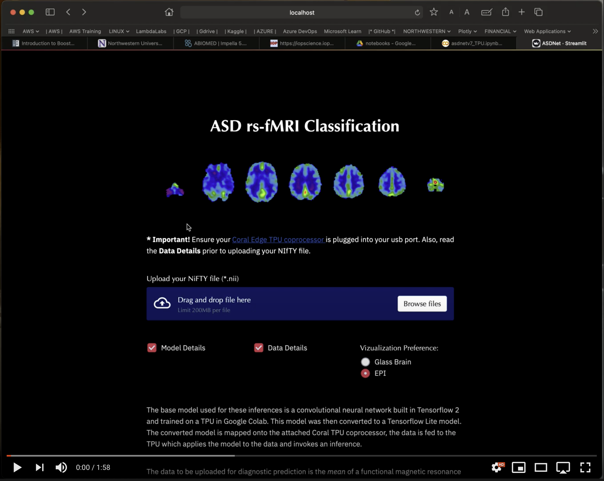

<h1 align="center"> ASDNet </h1>

This is an ongoing research project that attempts to diagnose Autism Spectrum Disorder (ASD) by classifying function magnetic resonance images (fMRIs) with convolutional neural networks (CNNs).  A great deal of preparatory work has gone into this project leaving much work still to be done in the classification/modeling area.  This project is configured for Google Colab with a Tensor Processing Unit (TPU) for training, Google Cloud Storage (GCS) for data, model, and results retrieval/storage, and Coral Edge coprocessor for inference.

This repo is the **2nd of 2 repos** for this project.  The 1st repo can be found at https://github.com/ericcchase/asd_mri_prediction_modeling.git 

--- 

<u> This repo focuses on: </u>
  

**End-User Application**
The application created in this repo is intended to be used by radiologists as an easy, real-time diagnostic supplemental tool.  The user can upload fMRI data in NIfTY file format and gain a diagnostic prediction with confidence values.  The application leverages a Coral Edge TPU coprocessor connected through a USB port on the local machine for instantaneous predictions.  With this setup, patient privacy is ensured and fully HIPPA compliant (the data never leaves the local machine in this workflow and thus side-steps any network security and cloud storage security issues).

<h3 align="center"> ASDNet App Demo Video </h3>

  
   
  <a href="https://youtu.be/Sm_a8aFiApo"> Click to watch! </a>

